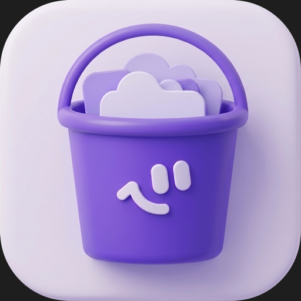

# BucketFinder

**by AssistLabs**

클라우드 버킷 스토리지를 macOS Finder처럼 다루는 무료 크로스플랫폼 데스크톱 클라이언트

[다운로드](../../releases) · [지원](../../issues)

---

**Mac과 Windows를 지원하는 무료 S3 클라이언트.** 일반 Finder나 파일탐색기처럼 S3 버킷을 손쉽게 다룹니다.

핵심 특징:
- 한국어 · 영어 · 일본어 네이티브 지원
- 영상 · 이미지 즉시 미리보기
- 멀티파트 전송 · 대량 전송에 강한 설계
- 객체 태그 지원

> 이 저장소는 BucketFinder의 **다운로드 배포 채널**입니다. 소스 코드는 별도 비공개 저장소에서 관리됩니다.
> 현재는 AWS S3를 지원하며, GCS 등 멀티 클라우드 확장이 예정되어 있습니다.

---

## 📥 다운로드 (Download)

가장 최신 빌드는 [Releases](../../releases) 페이지에서 받을 수 있습니다.

| 플랫폼 | 파일 | 비고 |
|---|---|---|
| macOS (Apple Silicon + Intel) | `BucketFinder_*_universal.dmg` | Universal Binary 단일 파일로 두 칩셋 모두 지원 |
| Windows 10/11 (64-bit) | `BucketFinder_*_x64-setup.exe` | NSIS 설치 프로그램 |

> 다운로드 페이지 하단의 **`Source code (zip)` / `Source code (tar.gz)`** 는 GitHub이 자동 첨부하는 README 아카이브입니다 (실제 앱 소스 아님). **무시하셔도 됩니다.**

---

## 💻 시스템 요구사항 (Requirements)

- **macOS**: 12.0 Monterey 이상 (Apple Silicon · Intel 모두)
- **Windows**: 10 이상 (64-bit)
- **메모리**: 권장 4 GB 이상
- **인터넷 연결**: AWS S3 통신용

---

## 첫 실행 안내

### macOS

정식 출시 빌드로, `.dmg`를 열고 앱을 `/Applications`로 드래그하면 별도 설정 없이 바로 실행됩니다.

### Windows — "Windows에서 PC를 보호했습니다" 경고

Windows 빌드는 아직 코드사이닝 전이라 첫 실행 시 SmartScreen 경고가 표시됩니다.

1. 다운받은 `.exe`를 더블클릭
2. SmartScreen 경고가 나타나면 **"추가 정보"** 클릭
3. **"실행"** 버튼이 나타나면 클릭

> 이 경고는 향후 Windows 코드사이닝 인증서 적용 후 사라집니다.

---

## 🚀 시작하기 (Getting Started)

설치 후 첫 실행 시:

1. 앱이 열리면 **"계정 추가"** 클릭
2. AWS Access Key ID + Secret Access Key + 리전 입력
3. **"연결 테스트"** 또는 **"저장"** — STS GetCallerIdentity로 자격증명을 검증합니다
4. 검증 성공 시 자동으로 활성 계정 전환, 버킷 목록이 표시됩니다

### 자격증명 안전성

- Secret Access Key는 OS 네이티브 키체인(macOS Keychain / Windows Credential Manager)에만 저장됩니다
- 앱 내부 어디에도 평문으로 보관되지 않습니다
- 외부 서버로 전송되지 않습니다 — 사용자의 AWS 계정에 직접 연결됩니다

### 데이터 보관 위치 (앱을 깨끗이 초기화하려면)

앱 메타데이터(계정 목록 등)와 시크릿은 다음 위치에 저장됩니다:

**macOS**
- 메타데이터: `~/Library/Application Support/com.assistlabs.bucketfinder/`
- 시크릿: Keychain Access.app → 검색 `com.assistlabs.bucketfinder`

**Windows**
- 메타데이터: `%APPDATA%\com.assistlabs.bucketfinder\`
- 시크릿: 자격 증명 관리자(Credential Manager) → `com.assistlabs.bucketfinder`

앱을 다시 설치해도 위 데이터는 유지됩니다. 처음부터 시작하시려면 해당 항목을 삭제 후 앱을 재실행하세요.

---

## 🛠 주요 기능 (Features)

- 다중 AWS 계정 등록·전환 (OS 키체인 보안 저장)
- 버킷 탐색 (리스트/그리드 뷰, 폴더 네비게이션, 이미지 썸네일)
- **수백 개 버킷도 가볍게** — 버킷 이름 즉시 표시(리전은 백그라운드 로드) + 사이드바 버킷 필터로 빠른 검색
- **즐겨찾기** — 자주 쓰는 버킷·경로를 별표로 저장하고 사이드바에서 원클릭 이동 (계정별 관리)
- 하단 상태 표시줄 — 현재 경로 + 실시간 업/다운로드 속도
- 파일 업/다운로드 (멀티파트, 일시정지·재개·취소)
- 대량 전송 대시보드 — 배치 진행률·실패 일괄 재시도·동시 전송 상한(업로드 3 / 다운로드 5)
- 전송 배치 완료 시 OS 시스템 알림 (백그라운드)
- 파일 관리 (복사·이동·이름변경·삭제·폴더 생성)
- prefix 기반 검색 + 확장자·크기·날짜 필터 (현재 폴더 / 버킷 전체)
- 이미지·동영상 즉시 미리보기 (썸네일 + 스트리밍)
- 파일 정보 패널 (메타데이터·태그·ACL·스토리지 클래스)
- 다크모드 (시스템 자동 연동 + 수동 전환)
- 전체 키보드 단축키

---

## 💬 지원 (Support)

- 버그 신고·기능 제안: [Issues](../../issues)
- 사용 중 발생한 오류는 가능하면 다음 정보와 함께 등록해주세요:
  - 앱 버전 (앱 → 정보)
  - OS와 버전
  - 재현 단계

---

## 📄 라이선스 (License)

- **앱 바이너리**: 무료 사용 (개인·상업 모두 허용)
- **소스 코드**: 비공개 (closed-source)

---

_BucketFinder by AssistLabs_
